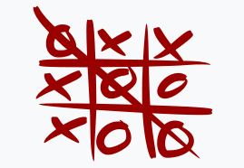

# Tic_tac_toe_game


> A collaborative project to build Tic-tac-toe-game

## Built With


## Game Instructions

* How do we play Tic Tac Toe?

- Players take turns playing
- 1st turn — Player 1
- Player 1 places their token (X) in only 1 square of their choice
- 2nd turn — Player 2
- Player 2 places their token (O) in only 1 square of their choice, except they can’t touch the square that Player 1’s token already fills
- 3rd turn- Player 1 …. and the cycle continues until a player wins or there’s a tie game
- There are 8 winning combinations: Top row, Middle row, Bottom row, Left column, Middle column, Right column, Left diagonal, and Right diagonal
- There’s a draw/tie when the entire board is filled with X’s and O’s but no winning combinations can be found

* A winning combination should look like



## Getting Started

To get a local copy up and running follow these simple example steps.

### Prerequisites

1. VSCode

2. Terminal (Bash)

3. Linter tests

4. Git

5. Ruby

### Setup

Setup by  following the installation instructions below :

* Open your terminal and locate on the folder you want to clone the repository.

* Setup
 Create a new folder/directory for the project
 Be sure to have a Github account and that this account is connected locally on your PC

* Install
 Go to the desired directory on your terminal
 git clone https://github.com/Emmyn5600/Tic_tac_toe_game.git

* Run
 On your terminal, type bin/main.rb

### Install

Run the following command into your terminal:

```console
git clone https://github.com/Emmyn5600/Tic_tac_toe_game.git
```

### Usage

Run the following command into your terminal:

```console
ruby bin/main.rb
```

## Authors

👤 **NSABIMANA Emmanuel**

- GitHub: [@emmyn5600](https://github.com/Emmyn5600)
- Twitter: [@NSABIMA62253884](https://twitter.com/NSABIMA62253884)
- LinkedIn: [@nsabimana-emmanuel-4276091b2](https://www.linkedin.com/in/nsabimana-emmanuel-4276091b2/)

👤 **Tiago Rahal Aires**

- GitHub: [@tiagorahal](https://github.com/tiagorahal)
- Twitter: [@RahalAires](https://twitter.com/RahalAires)
- LinkedIn: [Tiago Rahal Aires](https://linkedin.com/tiagorahal)

## 🤝 Contributing

Contributions, issues, and feature requests are welcome!

Feel free to check the [issues page](https://github.com/Emmyn5600/Tic_tac_toe_game/issues).

## Show your support

Give a ⭐️ if you like this project!

## Acknowledgments

- Thanks to Microverse and their supportive community.
- Thanks to everyone commiting in this project.

## 📝 License

This project is [MIT](./MIT.md) licensed.

